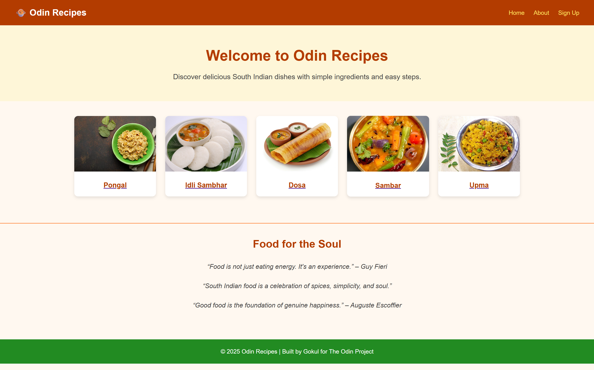

# Odin Recipes & Landing Page

This repository contains my work for two assignments from [The Odin Project](https://www.theodinproject.com/):  

1. **Recipes Project (HTML focus)** – to practice basic HTML structure, linking, and building a small website.  
2. **Landing Page Project (HTML + CSS + Flexbox focus)** – to practice styling and layout using CSS and Flexbox.  

Instead of keeping them separate, I deliberately **combined both projects into one repo** to simulate how projects naturally evolve (from plain HTML → styled with CSS).  
This also shows how incremental iterations build upon each other.

---

## 📌 Project Iterations

### Iteration 1–4: HTML-only version
- Basic HTML structure and navigation.  
- Recipe pages with descriptions, ingredients, and steps.  
- Homepage linking all recipes.  

📸 Preview:  

---

### Iteration 5: Styling with CSS (Landing Page Assignment)
- Added `style.css` to introduce styling with Flexbox.  
- Designed a consistent **header, hero section, recipe cards grid, and footer**.  
- Added background colors and theme inspired by **South Indian food culture**.  
- Unified look and feel across all recipe pages.  
- Added inspirational food quotes above the footer.  

📸 Preview:  

---

## 🚀 Live Demo
- **GitHub Repo:** [odin-recipes](https://github.com/gokulselvam2911/odin-recipes)  
- **Netlify Deployment:** [Odin Recipes on Netlify](https://odin-recipes-gokul.netlify.app/)  

---

## 📖 Skills Demonstrated
- Semantic HTML structure.  
- Linking pages and organizing a project.  
- CSS styling and theming.  
- Flexbox for layout and alignment.  
- Incremental project building & version control (commits/iterations).  

---

## 🔮 Future Plans
I plan to extend this project further into something like an **Instagram for Recipes**:
- User authentication (login/register).  
- Add & share recipes.  
- Comments & likes.  
- Personalized recipe feeds.  

---

## 🙌 Acknowledgments
- Project guidelines from [The Odin Project](https://www.theodinproject.com).  
- Free food images from [Unsplash](https://unsplash.com/) and [Pexels](https://pexels.com/).  
